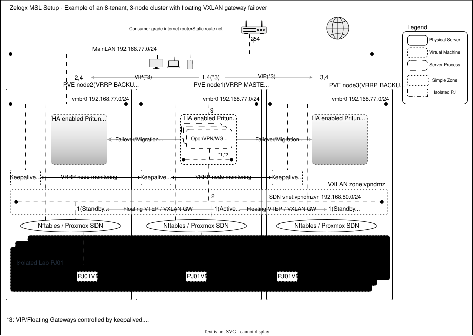

# Multiverse Secure Lab (MSL) Setup for Proxmox by Zelogx™

[](https://github.com/zelogx/msl-setup/discussions)
[](https://github.com/zelogx/msl-setup/wiki/)
[](https://www.zelogx.com)
[](https://www.zelogx.com/documents/release-notes/)


Zelogx™ MSL Setup (Multiverse Secure Lab Setup) is a multi-tenant enablement tool for Proxmox, designed for anything from a single node to a Proxmox cluster. It creates isolated multi-tenant environments for each project or team.

It automatically configures Proxmox SDN and firewall rules, transforming a plain hypervisor into a collection of multi-tenant-ready virtual spaces. With v2.0, cluster support was added, enabling isolated networks to span multiple nodes through VXLAN Zones and VNets.

By automatically attaching a dedicated VPN to each tenant, it enables authorized users to securely access the appropriate project subnet from anywhere. With GUI-based VPN management through Pritunl and MFA, it minimizes operational overhead while keeping robustness enforced by mechanisms rather than manual discipline.

> [日本語版はこちら (README_jp.md)](./README_jp.md) <BR>
> Official Web Site is [here](https://www.zelogx.com)

© 2025 Zelogx. Zelogx™ and the Zelogx logo are trademarks of the Zelogx Project. All other marks are property of their respective owners.

## 1. Overview

This project builds **completely isolated development environments per project** at Layer 2, accessible securely via VPN.\
It's a blueprint for **low-cost distributed development**, offshore projects, or private team labs.

For the architecture background, design rationale, and engineering principles behind MSL Setup, see [ARCHITECTURE_AND_DESIGN_PRINCIPLES.md](./ARCHITECTURE_AND_DESIGN_PRINCIPLES.md).

Note:  
The following repository contains the **manual setup procedure** corresponding to this setup script.

[MSL Setup Basic](https://github.com/zelogx/proxmox-msl-setup-basic/blob/main/build-instructions.md)

See below for architecture diagram.
With this architecture, VMs/CTs on any node in the cluster can access the same isolated project network, and workloads running on different nodes behave as if they were connected on a single host.  
Even if a node failure occurs, communication can continue through gateway failover.



<section id="quickstart">

## 2. Quickstart
> Please see [**Environmental Integrity & System Impact Report**](https://github.com/zelogx/msl-setup/wiki/Environmental-Integrity-&-System-Impact-Report) if you hesitate to run.<BR>
> The interactive installer detects overlapping networks and prevents you from selecting addresses that conflict with existing networks inside Proxmox.<BR>
> Please refer to [**Step-by-Step Install instruction**](https://github.com/zelogx/msl-setup/wiki/I-Tried-Installing-a-Multi%E2%80%90Tenant-Tool-on-My-Home-PVE-%E2%80%93-Install-Edition) also for detail installation steps.


``` bash
# In Corporate edition,
unzip msl-setup-pro-x.x.x_corporate.zip    # change x to correct version number
cd msl-setup-pro-x.x.x_corporate

# In MSL Setup (Personal Edition),
apt install -y git
git clone https://github.com/zelogx/msl-setup.git
cd msl-setup

# Phase 0: TUI Network Auto Configuration (Check existing network + Automatic network config)
./00_configNetwork.sh en  # Language: en|jp (default en)

# Phase 1: Network Setup (check config + SDN setup)
./01_networkSetup.sh en   # Language: en|jp (default en)
./01_networkSetup.sh en --restore   # Restore SDN/network config to backup state

# Phase 2: VPN Setup (Pritunl VM deployment + configuration)
./02_vpnSetup.sh en       # Language: en|jp (default en)
```
> [!NOTE]
> About `02_vpnSetup.sh`
>
> * The Pritunl VM provides VPN-based remote access to VMs within each tenant. If you prefer to establish access using a different method (such as Tailscale), you can skip running this script. In that case, you are responsible for implementing appropriate security measures for the tenant and MainLAN environment separately.
> * The Pritunl VM is not automatically registered as an HA resource upon completion of the installation. If you need to manage the Pritunl VM with Proxmox HA in a clustered environment, configure Proxmox HA separately.
> * To verify the reachability of the UDP port used by the VPN, an HTTPS request is sent to the public probe API provided by MSL Setup. This is intended to detect during installation whether the VPN server is externally unreachable due to router port forwarding settings or the characteristics of the network connection.
> * The only data sent to the probe is the UDP port number to be checked. Only the source public IP address and its UDP port number are retained in the logs.
> * The probe operates by returning UDP packets only to the global IP address from which the probe request originated. It does not provide any mechanism for sending packets to an arbitrary third-party IP address.
> * The public probe API is operated on a host located in Japan.


```bash
# Phase 3 (Pro Corporate only): RBAC Self-Care Portal Setup
./0301_setupSelfCarePortal.sh en   # Language: en|jp (default en)

# (Optional) Uninstall MSL setup completely
./99_uninstall.sh en   # Language: en|jp (default en)
# This will:
#   1. Destroy Pritunl VM (calls 0201_createPritunlVM.sh --destroy)
#   2. Restore network configuration to backup state (calls 0102_setupNetwork.sh --restore)

# (Optional) Cluster operation commands
# No action is required if the Proxmox cluster was already enabled during the initial setup in v2.0 or later.
# Run `add-node` when adding a new node to the cluster
mslcm enable-cluster        # Promote MSL Setup to a cluster-enabled configuration
mslcm disable-cluster       # Revert MSL Setup to a single-node configuration
mslcm add-node <IP address> # Add a node to the MSL Setup cluster configuration
mslcm del-node <IP address> # Remove a node from the MSL Setup cluster configuration

# (Optional) Tenant DHCP deployment command
# Proxmox SDN (VXLAN zone) does not yet support DHCP,
# so msldhcp deploys a dedicated DHCP CT for each tenant (vnetpjXX).
# This is only required when using guest VM/CT images that do not assume static IP assignment,
# such as VulnHub images.
# Nothing is installed for tenants that do not need DHCP.
msldhcp                     # Interactive mode: select a tenant (VNet) and VMID to create a DHCP CT.
msldhcp --vmid <VMID> --vnet <VNetName>  # Run non-interactively with explicit arguments.
```

> [!NOTE]
> **Additional Notes on `msldhcp`:**
>
> * This applies only to VNets that are both in a VXLAN zone and named `vnetpj*`. The DHCP range is automatically configured when `0102_setupNetwork.sh` is executed, so no additional configuration is normally required.
> * The DHCP allocation range can be viewed and modified under `Datacenter > SDN > VNets > (Target VNet) > Subnets > DHCP Ranges`.
>   By default, the available address range within the subnet is assigned, excluding two addresses: the gateway address (the last address) and the address immediately preceding it, which is reserved for the DHCP server CT.
>   For example, for `172.19.16.0/24`, the DHCP range is `172.19.16.1-172.19.16.252`, `.253` is reserved for the DHCP server CT, and `.254` is reserved for the gateway.
> * If multiple CT rootfs/template storage locations are available, you will be prompted to select one interactively.
> * No debug user is created. To inspect the contents of the CT, use `pct exec <VMID> -- bash`.

</section>

---

## 3. Get started

All open-source components --- reproducible setup from scratch.

### 3.1. Requirements

- Proxmox VE 9.0+ host(s)
- Internet router (for port forwarding VPN traffic)

### 3.2. Upgrade

Direct upgrade from v1.x is not supported.
To install v2.x, uninstall v1.x first by running `./99_uninstall.sh`, then proceed with the v2.x installation.

### 3.3. Network Design Considerations

MSL Setup automatically proposes network addresses, so you do not need to design all of the following values in advance.
However, because it cannot automatically identify every network address already used in your environment, please make sure that the proposed addresses do not overlap with any existing networks.
If necessary, you can adjust them by using the custom setup in `00_configNetwork.sh`.

In custom setup, the following network addresses need to be provided. Please configure them appropriately.
If your environment has no additional subnets other than the one connected to Proxmox VE, you can generally keep the example values below as-is, except for (a) and (b), which should be set according to your actual network to avoid conflicts.


#### a. MainLan (existing vmbr0): (e.g., 192.168.77.0/24 GW: .254)
- The network address of your company or home lab’s main LAN.
- This LAN is likely connected to smart speakers, TVs, game consoles, employees’ or family members’ PCs and smartphones, as well as lab-related VMs (such as web servers, Cloudflared, Nextcloud, Samba, personal OpenVPN/WireGuard servers, Unbound DNS, etc.).\
However, all VMs belonging to individual projects (VMnPJxx) are completely isolated by the PVE Firewall and vnet, ensuring secure separation.
- The “Pritunl mainlan-side IP” configured later must fall within this IP range.
- Since most internet routers can only perform port forwarding to LAN-side IP addresses, it is recommended that the Proxmox VE host be connected directly under the router’s LAN segment.

#### b. Proxmox VE host mainlan IP: (e.g., 192.168.77.7)
- This becomes the destination IP when adding a static route to the Internet router. (Auto-detected, for display)

#### c. vpndmzvn (VPN transit network): (e.g., 192.168.80.0/24 GW: 192.168.80.1)
- Route used by VPN clients to access development project subnets.
- Requires at least a /30 network.

#### d. VPN client address pool: (e.g., 192.168.81.0/24)
- Separated for wg and ovpn. Example: 192.168.81.2–126/25, 192.168.81.129–254/25
- Further divided into /28 based on the “number of isolated development segments to be created.”
- Maximum VPN-capable clients per project is 13. For offshore distributed development, securing more would be better.

#### e. Number of isolated development segments (number of projects) to create: (e.g., 8)
- Minimum is 2, and must be a power of two: 2, 4, 8, 16, etc.
- If the number of projects is 8: project IDs will be 01–08, and segments will be vnetpj01 to vnetpj08.

#### f. Network address assigned to each project (vnetpjxx) (new): (e.g., 172.16.16.0/20)
- Network segment for each project. This IP range is divided according to the “number of isolated development segments to be created.”
- Example: If the network address assigned to vnetpjxx is 172.16.16.0/20 and you are creating 8 segments, it will be divided accordingly as shown below.
- VM groups inside vnetpjxx (172.16.16.0/24) can communicate freely within that segment.
- Firewall settings for these VMs are controlled by Security Groups (SG).
- Mapped to Pritunl server instances and organizations.

#### g. Pritunl mainlan-side IP: (e.g., 192.168.77.10)
- This becomes the forwarding destination IP when adding port-forwarding rules on the Internet router.

#### h. Pritunl vpndmzvn-side IP: (e.g., 192.168.80.2)
- Subnet used by Pritunl clients when they exit toward each project’s subnet. Minimum /30 is sufficient but we allocate a larger /24 here.

#### i. UDP ports: 
- Number of isolated development segments (projects) × 2 = (16)

**Note:**
- Some routers limit the number of port-forwarding entries. For example, Buffalo routers allow a maximum of 32. Therefore, when deciding (e), you should also consider your router’s maximum port-forwarding capacity.
- Also, if you are using IPoE with ND Proxy / MAP-E / DS-Lite, there are restrictions on available ports, so you must check in advance.

## 4. Known Issues

- **Network diagram theme behavior**  
    The color scheme of SVG-based network diagrams does **not** follow the Proxmox GUI theme (Light/Dark).  
    Instead, it respects the OS / browser `prefers-color-scheme` setting.  
    As a result, when your OS or browser is set to light mode, the diagram may appear with light-theme colors even if the Proxmox GUI is using the dark theme (and vice versa).

- **Error when recreating a Pritunl VM**
   When reinstalling after manually detaching a disk from the VM, an orphan volume may remain (the workaround is now shown in the error message).

## 5. Why This Design Still Matters

Public clouds deliver global scale and strong SLAs — no argument there.
But when the goal is controlled, secure, and cost-efficient team development, a well-designed on-prem environment still has a place.

This architecture proves that small software teams, SaaS startups, and serious home-lab engineers can build isolated, compliant, production-grade development labs without burning money or giving up autonomy.

Security, performance, and independence don’t have to be trade-offs.
They can coexist — by design.

---


## 6. Troubleshooting: UDP port forwarding validation failed

During `02_vpnSetup.sh`, you may encounter an error such as:

```bash
ERROR: UDP port forwarding validation failed
```
This check sends an HTTPS request to the public probe API used by MSL Setup and verifies reachability to the specified VPN UDP ports by having the probe return UDP packets only to the source global IP address of that request.

In other words, this is not a mechanism that can send packets arbitrarily to third-party hosts on the Internet.  
It is a limited connectivity check designed only to confirm whether the specified ports are reachable at the source global IP address that sent the HTTPS request.

This means that the specified UDP ports for the VPN server could not be reached from outside.  
In most cases, this is **not** an MSL Setup bug. It is usually caused by **router settings, ISP/network restrictions, or network path issues**.

### Checklist

1. **Verify the router port forwarding settings**
   - The expected UDP ports and destination IP are shown at the end of `01_networkSetup.sh`
   - Make sure the configured UDP ports are forwarded to the mainlan-side IP of the Pritunl VM

2. **If the `01_networkSetup.sh` console log is no longer available**
   - Re-run it after uninstalling to confirm the required values again

```bash
./99_uninstall.sh
./01_networkSetup.sh
```

3. **If you want to change the port numbers and restart from scratch**
   - Re-run from `00_configNetwork.sh`

```bash
./99_uninstall.sh
./00_configNetwork.sh
```

4. **If the port forwarding settings look correct but it still fails**
   - Your router may not support forwarding to an IP in another network segment
   - If Proxmox is not directly connected under the router, forwarding may fail depending on the topology
   - Some Internet environments such as IPoE / MAP-E / DS-Lite / ND Proxy may restrict available ports

5. **Re-run after fixing the issue**
   - After making corrections, run:

```bash
./02_vpnSetup.sh
```

### If you do not need the VPN server

To delete the deployed Pritunl VM:

```bash
./0201_createPritunlVM.sh --destroy
```

### If you want to skip this validation temporarily

Create the following file, then run `02_vpnSetup.sh` again:

```bash
touch /root/demo
./02_vpnSetup.sh
```

### Notes

Even if this validation fails, the **VM itself may already be deployed and still running**.  
You can inspect it manually if needed:

```bash
ssh root@<Pritunl-VM-IP>
ping <GW IP Address>
```

### Security & Design Choices (FAQ)

**Q: How does MSL Setup provide VXLAN gateway failover without requiring enterprise-grade network equipment?**

**A:** MSL Setup v2.0 keeps isolated project networks available across cluster nodes by using automatic VXLAN gateway failover within the Proxmox cluster itself.

---

**Q: Can VM hopping be prevented?**

**A:** Yes, isolation is enforced at the lab (tenant) boundary.

---

**Q: How are API tokens and permissions handled?**

**A:** Zelogx MSL Setup does not use the Proxmox API with tokens. It runs locally on the node and uses the native Proxmox CLI (`pvesh` and related tools) under root.
