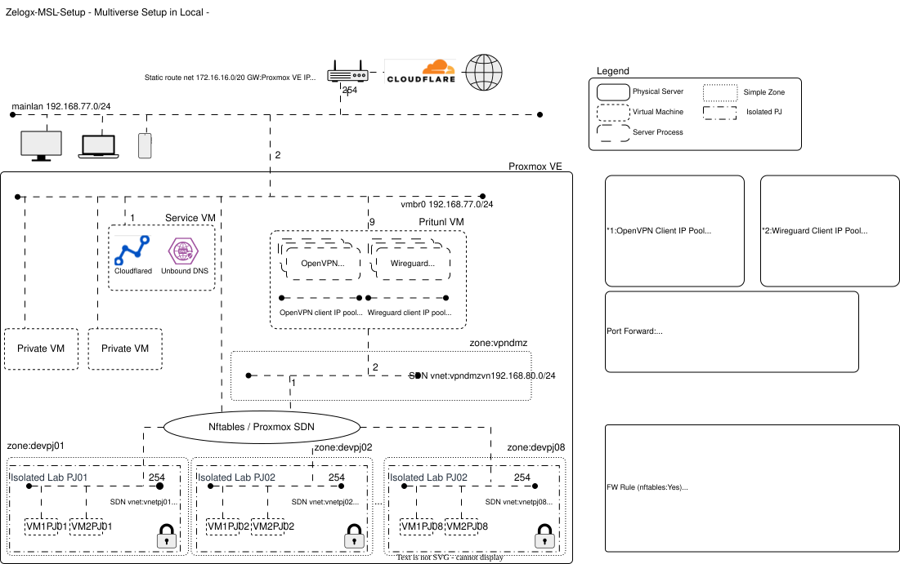

# Multiverse Secure Lab (MSL) Setup for Proxmox by Zelogx™

[](https://github.com/zelogx/msl-setup/discussions)
[](https://github.com/zelogx/msl-setup/wiki/)
[](https://www.zelogx.com)
[](https://www.zelogx.com/documents/release-notes/)


Zelogx™ MSL Setup (Multiverse Secure Lab Setup) is a multi-tenant setup tool that virtually partitions a single Proxmox server into isolated environments for each project or team.  

By automatically attaching a dedicated VPN to each tenant, it lets authorized users securely reach the right project zone from anywhere.  
Concretely, it configures Proxmox SDN (Simple Zones + VNets) and firewall rules for you, transforming a plain hypervisor into a collection of multi-tenant–ready virtual spaces. With GUI-based VPN management (Pritunl) and MFA, it minimizes operational overhead while keeping robustness enforced by mechanisms rather than manual discipline.

> [日本語版はこちら (README_jp.md)](./README_jp.md) <BR>
> Official Web Site is [here](https://www.zelogx.com)

© 2025 Zelogx. Zelogx™ and the Zelogx logo are trademarks of the Zelogx Project. All other marks are property of their respective owners.

## 0. Overview

This project builds **completely isolated development environments per project** by Layer 2 level, accessible securely via VPN.\
It's a blueprint for **low-cost distributed development**, offshore projects, or private team labs.

Note:  
The following repository contains the **manual setup procedure** corresponding to this setup script.

[MSL Setup Basic](https://github.com/zelogx/proxmox-msl-setup-basic/blob/main/build-instructions.md)

See below for architecture diagram.


## 1. Quickstart
> Please see [**Environmental Integrity & System Impact Report**](https://github.com/zelogx/msl-setup/wiki/Environmental-Integrity-&-System-Impact-Report) if you hesitate to run.<BR>
> The interactive installer detects overlapping networks and prevents you from selecting addresses that conflict with existing networks inside Proxmox.<BR>
> Please refer to [**Step-by-Step Install instruction**](https://github.com/zelogx/msl-setup/wiki/I-Tried-Installing-a-Multi%E2%80%90Tenant-Tool-on-My-Home-PVE-%E2%80%93-Install-Edition) also for detail installation steps.


``` bash
apt update -y
apt install -y ipcalc jq zip
# Place the zip file on the proxmox server using scp or similar.

# In Corporate edition,
unzip msl-setup-pro-1.x.x_corporate.zip    # change x to correct version number
cd msl-setup-pro-1.x.x_corporate

# In MSL Setup (Personal Edition),
apt install -y git
git clone https://github.com/zelogx/msl-setup.git
cd msl-setup

# Phase 0: TUI Network Auto Configuration (Check existing network + Automatic network config)
./00_configNetwork.sh en  # Language: en|jp (default en)

# Phase 1: Network Setup (check config + SDN setup)
./01_networkSetup.sh en   # Language: en|jp (default en)

# Phase 2: VPN Setup (Pritunl VM deployment + configuration)
./02_vpnSetup.sh en       # Language: en|jp (default en)

# Phase 3 (Pro Corporate only): RBAC Self-Care Portal Setup
./0301_setupSelfCarePortal.sh en   # Language: en|jp (default en)

# (Optional) Uninstall MSL setup completely
./99_uninstall.sh en   # Language: en|jp (default en)
# This will:
#   1. Destroy Pritunl VM (calls 0201_createPritunlVM.sh --destroy)
#   2. Restore network configuration to backup state (calls 0102_setupNetwork.sh --restore)
```

### Security & Design Choices (FAQ)

**Q: Can VM hopping be prevented?**

**A:** Yes, isolation is enforced at the lab (tenant) boundary.

- **Within a lab**: VMs inside the same isolated lab are allowed to talk to each other. This keeps the environment useful for realistic app, cluster, or service testing.
- **Between labs**: Nftables + Proxmox SDN (the “Multiverse Enforcer”) prevent traffic from crossing project zones.
- **Lab to host / management**: Forwarding to anything outside the designated VPN client pool and the upstream internet gateway is blocked by default. Host-level management networks and other labs remain dark.

---

**Q: How are API tokens and permissions handled?**

**A:** Zelogx MSL Setup does not use the Proxmox API with tokens. It runs locally on the node and uses the native Proxmox CLI (`pvesh` and related tools) under root.

- **Why root?** Configuring SDN objects, bridges, and nftables rules is inherently a system-level operation on Proxmox.
- **Design choice**: Instead of adding another API surface (and token lifecycle) to secure, the tool relies on the existing Proxmox privilege model. All changes are visible as standard Proxmox SDN and firewall configuration, and there is no additional control plane to audit or harden.

### 1.1. What You Get (Engineer's Perspective)

On a single Proxmox VE node: 
- Per-project, fully isolated network segments with VPN-secured access for remote teammates. 
- Expose each project's environment to your team without risking the main LAN. 
- Secure design --- no packets other than VPN tunnels traverse and DNS inquiry into your corporate or home LAN.
- Automated client provisioning: user registration, certificate generation, and VPN management via Prutunl GUI.
- GUI-based server control (start/stop per project VPN). 
- No VLAN-capable switches required.
- **Corporate Edition only** Self-service VM management within your project network: project members can independently create, delete, start, stop VMs, and manage snapshots and backups without administrator intervention.

### 1.2. What You Get (Manager's Perspective)

- Grant access **only to what each partner/freelancer needs**, preventing cross-project leaks by design.
- Build a **private development cloud** for small/mid-size software firms or startups.
- Safer, faster, and cheaper than giving developers full cloud freedom.
- Entirely open-source --- all you need is **one small server (even a NUC)** and \~¥1,000/month for electricity.
- No vendor lock-in, no subscription required.

> Enterprise-grade solutions with similar capabilities are typically positioned at a significantly higher cost range.\
> This achieves the same goal for (almost) zero cost.

### 1.3. Comparison: Alternatives for personal / small office Proxmox multi-tenant setups

Several approaches exist for building multi-tenant environments on Proxmox.
The following table summarizes the practical differences.

| Method                 | Learning Curve | Network Isolation | Automation      | Individual-Friendly |
| ---------------------- | -------------- | ----------------- | --------------- | ------------------- |
| RBAC + Resource Pools  | **Medium**     | None              | GUI only        | Limited             |
| SDN + OPNsense         | **Very High**  | Strong            | Manual setup    | Partial             |
| **MSL Setup Basic**    | **Low**        | Strong            | Manual (Guided) setup | Excellent          |
| **MSL Setup Personal** | **Extremely Low** | Strong            | Fully automated | Excellent           |

For a deeper explanation of each approach, see the [Proxmox Multi-tenant Guide](https://github.com/zelogx/msl-setup/wiki/Proxmox-Multi%E2%80%90tenant-Guide).


### 1.4. Licensing

-   **Pritunl**\
    Free to use, with optional paid features for enterprise management.\
    A single enterprise license covers all servers in the cluster.\
    → [Pritunl](https://pritunl.com)

-   **Proxmox VE**\
The core Proxmox VE (PVE) software is open source and licensed under the GNU Affero General Public License v3 (AGPL v3). According to the official Proxmox stance, no “license fee” is charged — meaning there is no cost required to use the software itself. [Proxmox][1], [Proxmox Forum][2] \
However, paid subscriptions (support contracts) are offered separately.

[1]: https://pve.proxmox.com/?utm_source=chatgpt.com
[2]: https://forum.proxmox.com/threads/licensing-is-the-pve-no-subscription-free-usage-legal-and-valid.107184/?utm_source=chatgpt.com

### 1.5. Target Audience

- “We already let our developers freely spin up AWS instances to build a fast, distributed development environment. Security? Well… when someone asks that, management and executives of small software houses just glance at the person in charge for help.”
- “I have my own development/lab environment at home, so I aggressively spin up VMs and develop there. Other team members? I assume they’re each figuring things out on their own?”
- “These days I use WSL and run Linux VMs on my Windows PC. Security if I lose my PC? BitLocker keeps it safe… or so they say. Everyone develops in totally different environments. Integration testing takes forever (lol).”
- “Even in large enterprises, right. Servers are in the server room with strict access control. Basically, no personal data exists in the development environment. NDAs with each employee? Yes, we enforce those. And of course you can only log in through VDI. But the root password for all VMs is the same. And because they’re all on the same segment… theoretically, if someone wanted to log in to other VMs? They could, haha.”
- “Also in large enterprises: projects that need it each have their own VPN. If you can log into one VM, could you get into others too? I haven’t checked, but I don’t think so… We’ve never had such an incident. Plus, we conduct security training twice a year.”

### 1.6. Why This Matters

#### 1.6.1. Typical Problems in Cloud Dev Environments

Typical “Pain Points” When Development Environments Live in the Public Cloud
- Still assigning a public IP directly to the VM and SSHing straight into it
- Because it has a public IP, your untested web application server is actually exposed to the entire Internet
- Development environments across projects are visible to each other
- Spinning up a flood of instances without considering the blast radius
- Network bandwidth dying because of large data transfers (yes, that old meme)
- Approval → Estimation → Approval → Provisioning… What is “development speed” again?
- “Just for testing” instances … left running for six months
- Falling asleep waiting for builds on a weak CPU instance

    Are we really safe letting application developers with low security literacy — or people who “think they understand infrastructure” — operate the cloud freely?
    They’re not malicious. They simply lack the mechanisms required to fulfill the responsibilities expected of them.
    The result: exploding costs, expanded attack surfaces, permission spaghetti, and the phenomenon of
“Turns out on-prem was safer after all.”

**Result:** High cost, low visibility, accidental exposure.\
Even with best intentions, teams lack the "systemic guardrails" that prevent human error.

### 1.7. Cost Efficiency Example
Let’s compare AWS EC2 c5d.large (2 vCPUs) with a 2-vCPU VM running on an Intel NUC.\
The machine used in this project: Intel NUC Pro, Core i7-1360P (12 cores / 16 threads, up to 5.0 GHz).

| Item                     | AWS EC2 (c5d.large)      | 2-vCPU VM on NUC                          |
| ------------------------ | ------------------------ | ----------------------------------------- |
| Assigned vCPUs           | 2 vCPUs                  | 2 vCPUs                                   |
| Physical CPU             | Xeon Platinum 8124M      | Core i7-1360P                             |
| Physical CPU specs       | 18C/36T / max 3.5 GHz    | 12C/16T / max 5.0 GHz                     |
| RAM                      | 4 GB                     | Custom / as needed                        |
| Cost                     | **$89/month (~¥13,000)** | **~¥200/month electricity (for 2 vCPUs)** |
| Storage                  | EBS (billed separately)  | Local NVMe (high-speed, low-latency)      |
| Network charges          | Charged after 100 GB     | None (local LAN)                          |
| Performance (2-vCPU eq.) | Baseline                 | **~3.3–3.5× faster in benchmarks**        |
<BR>

Reference benchmark score (baremetal)

| Bench                  | Score(8124M) | Score@1360P |
| ---------------------- | ----: | ----: |
|PassMark single thread  |  2.040|  3.573|
|PassMark CPU Mark       | 22.287| 20.824|
|Geekbench 4 single core |  3.954|  6.517|
|Geekbench 4 multi core  | 35.420| 35.803|

Benchmarks show \~3.3x higher performance per vCPU compared to EC2.\
Refer to : [gadgetversus](https://gadgetversus.com/processor/intel-xeon-platinum-8124m-vs-intel-core-i7-1360p/)

### 1.8. Risks & Mitigations

| Risk             | Mitigation                                      |
| ---------------- | ----------------------------------------------- |
| Hardware failure | Use a secondary node with Proxmox Backup Server |
| Power outage     | UPS or planned manual shutdown                  |
| Overheating      | NUCs are rated for 35 °C continuous operation   |
| Data loss        | Backup to S3-compatible storage                 |
| Physical access  | Keep servers in restricted rooms or home labs   |

## 2. Get started

All open-source components --- reproducible setup from scratch.

### 2.1. Requirements

-   One Proxmox VE 9.0+ host
-   Internet router (for port forwarding VPN traffic)
-   Static IP (for Pritunl)
-   Optional: Cloudflare tunnel for GUI access

**Required packages** (auto-installed by setup scripts):
-   `git` - Retrieve the MSL Setup repository (Personal Edition)
-   `ipcalc` - Network address calculation utility
-   `jq` - JSON processing tool
-   `zip` - Archive extraction utility
-   `wget` or `curl` - Cloud-init image download
-   `sha256sum` - Image integrity verification
    
**Guest VM packages** (auto-installed during Phase 2):
-   `bind-utils` - `nslookup` for DNS validation
-   `nmap-ncat` - `nc` for UDP port probe
-   `pritunl-openvpn` - OpenVPN package from Pritunl repo (RHEL/AlmaLinux)

### 2.2. Network Design Considerations

You will need to provide the following network addresses, which must be configured appropriately.
If your environment has no additional subnets other than the one connected to Proxmox VE, you can generally keep the example values below as-is — except for (a) and (b), which should be set according to your actual network to avoid conflicts.


#### a. MainLan (existing vmbr0): (e.g., 192.168.77.0/24 GW: .254)
- The network address of your company or home lab’s main LAN.
- This LAN is likely connected to smart speakers, TVs, game consoles, employees’ or family members’ PCs and smartphones, as well as lab-related VMs (such as web servers, Cloudflared, Nextcloud, Samba, personal OpenVPN/WireGuard servers, Unbound DNS, etc.).\
However, all VMs belonging to individual projects (VMnPJxx) are completely isolated by the PVE Firewall and vnet, ensuring secure separation.
- The “Pritunl mainlan-side IP” configured later must fall within this IP range.
- Since most internet routers can only perform port forwarding to LAN-side IP addresses, it is recommended that the Proxmox VE host be connected directly under the router’s LAN segment.

#### b. Proxmox PVE’s mainlan IP: (e.g., 192.168.77.7)
- This becomes the destination IP when adding a static route to the Internet router. (Auto-detected, for display)

#### c. vpndmzvn (new): (e.g., 192.168.80.0/24 GW: 192.168.80.1)
- Route used by VPN clients to access development project subnets.
- Requires at least a /30 network.

#### d. Client-distributed IPs: (e.g., 192.168.81.0/24)
- Separated for wg and ovpn. Example: 192.168.81.2–126/25, 192.168.81.129–254/25
- Further divided into /28 based on the “number of isolated development segments to be created.”
- Maximum VPN-capable clients per project is 13. For offshore distributed development, securing more would be better.

#### e. Number of isolated development segments (number of projects) to create: (e.g., 8)
- Minimum is 2, and must be a power of two: 2, 4, 8, 16, etc.
- If the number of projects is 8: project IDs will be 01–08, and segments will be vnetpj01 to vnetpj08.

#### f. Network address assigned to each project (vnetpjxx) (new): (e.g., 172.16.16.0/20)
- Network segment for each project. This IP range is divided according to the “number of isolated development segments to be created.”
- Example: If the network address assigned to vnetpjxx is 172.16.16.0/20 and you are creating 8 segments, it will be divided accordingly as shown below.
- VM groups inside vnetpjxx (172.16.16.0/24) can communicate freely within that segment.
- Firewall settings for these VMs are controlled by Security Groups (SG).
- These segments are mapped to a Pritunl server instances and organization.

#### g. Pritunl mainlan-side IP: (e.g., 192.168.77.10)
- This becomes the forwarding destination IP when adding port-forwarding rules on the Internet router.

#### h. Pritunl vpndmzvn-side IP: (e.g., 192.168.80.2)
- Subnet used by Pritunl clients when they exit toward each project’s subnet. Minimum /30 is sufficient but we allocate a larger /24 here.

#### i. UDP ports: 
- Number of isolated development segments (projects) × 2 = (16)

**Note:**
- Some routers limit the number of port-forwarding entries. For example, Buffalo routers allow a maximum of 32. Therefore, when deciding value 5, you should also consider your router’s maximum port-forwarding capacity.
- Also, if you are using IPoE with ND Proxy / MAP-E / DS-Lite, there are restrictions on available ports, so you must check in advance.

## 3. Known Issues

- **Network diagram theme behavior**  
    The color scheme of SVG-based network diagrams does **not** follow the Proxmox GUI theme (Light/Dark).  
    Instead, it respects the OS / browser `prefers-color-scheme` setting.  
    As a result, when your OS or browser is set to light mode, the diagram may appear with light-theme colors even if the Proxmox GUI is using the dark theme (and vice versa).

## 4. Why This Design Still Matters

Public clouds deliver global scale and strong SLAs — no argument there.
But when the goal is controlled, secure, and cost-efficient team development, a well-designed on-prem environment still has a place.

This architecture proves that small software teams, SaaS startups, and serious home-lab engineers can build isolated, compliant, production-grade development labs without burning money or giving up autonomy.

Security, performance, and independence don’t have to be trade-offs.
They can coexist — by design.

---


### Motivation

#### The Problem: The "Flat Network" Trap in Proxmox

When I needed to share my Proxmox development environment with team members over VPN, I ran into a familiar set of problems:

- **Visibility vs. Privacy**: A typical VPN setup tends to expose too much. I wanted each team member to see their own project VMs, but not my personal lab, other clients' environments, or the host infrastructure.
- **Management Overhead**: Manually issuing, revoking, and organizing VPN profiles for multiple users across multiple projects does not scale. It’s tedious and error-prone.
- **The Isolation Gap**: Proxmox is powerful, but achieving true L2 isolation between “tenants” while still keeping VPN access simple usually means hand-rolling SDN + firewall rules. Repeating that setup reliably is hard.

#### The Solution: Building the "Multiverse"

I went looking for a tool that could:

- Spin up a secure, isolated "bubble" (a tenant) per project
- Attach a dedicated VPN gateway to that bubble
- Handle the boilerplate around VPN profile management

I couldn’t find it.

So I built **Zelogx MSL Setup**.

Zelogx turns a single Proxmox VE host into a multi-tenant lab provider. It’s aimed at engineers who need to give secure, isolated access to specific resources without exposing the rest of their infrastructure.

---

### Architecture

(Refer to the high-resolution network diagram in this repository for full details.)

```plaintext
+----------------+       +------------------+
|  VPN Client    | ----> |  Cloudflare /    |
| (Team Member)  |       |  Internet        |
+----------------+       +------------------+
        |                        |
        | VPN Tunnel (UDP/TCP)   | Port Forwarding
        v                        v
+=========================================================================+
|  Proxmox VE Host (Physical Server)                                      |
|                                                                         |
|    +----------------------------------------+                           |
|    | Pritunl VM (VPN Gateway)               |                           |
|    |  [OpenVPN Servers]  [WireGuard Servers]|                           |
|    |         |                  |           |                           |
|    +---------+------------------+-----------+                           |
|              | VPN Traffic (Decrypted)                                  |
|              v                                                          |
|    +----------------------------------------+                           |
|    |  SDN Zone: vpndmz (192.168.80.0/24)    |                           |
|    +----------------------------------------+                           |
|              |                                                          |
|              | (Routing & Firewalling)                                  |
|    +=========v==============================+                           |
|    | Nftables / Proxmox SDN Engine          |  <-- "Multiverse"         |
|    | (L2/L3 Isolation Enforcement)          |      Enforcer             |
|    +=========+====================+=========+                           |
|              |                    |                                     |
|    +---------v-------+    +-------v-------+         +-------v-------+   |
|    | Zone: devpj01   |    | Zone: devpj02 |         | Zone: devpjNN |   |
|    | [Isolated Lab]  |    | [Isolated Lab]|   ...   | [Isolated Lab]|   |
|    | 172.16.16.0/24  |    | 172.16.17.0/24|         | 172.16.xx.0/24|   |
|    +-----------------+    +---------------+         +---------------+   |
|       | VM1 | VM2 |          | VM1 | VM2 |             | VMs... |       |
|       +-----+-----+          +-----+-----+             +--------+       |
|            (🔒)                   (🔒)                      (🔒)         |
+=========================================================================+
LEGEND: ---> Traffic Flow, [🔒] Isolated Project Environment
```

---

### Engineering Principles

#### 1. Pre-configuration over Runtime Overhead

Zelogx MSL Setup is designed as a **pre-configuration tool**.

- **No long-running daemons**: All SDN objects, isolation rules, and VPN gateways are provisioned up front.
- **Static security posture**: Once the setup is complete, the environment is “baked into” Proxmox. There is no separate “Zelogx service” that can crash, drift, or introduce its own attack surface at runtime.

#### 2. 100% Native Proxmox Building Blocks

We try to stick to the “power of boring technology”.

- **Standard features only**: The tool uses native Proxmox VE components — `pvesh`, Proxmox SDN (Simple/VLAN zones), and the built-in nftables integration.
- **Update-friendly**: There are no custom kernel modules or out-of-tree drivers. You keep getting regular Proxmox updates without carrying extra technical debt.

#### 3. Pritunl Automation (VPN Provisioning)

The VPN side is fully automated using the official Pritunl HTTP API.

During the VPN setup phase, MSL Setup:

1. Boots the Pritunl VM via cloud-init.
2. Waits for the Pritunl service to become ready.
3. Uses the Pritunl API (key/secret configured inside the VM) to:
   - Create one or more **Organizations**
   - Create the required **Servers** (OpenVPN / WireGuard)
   - **Attach Organizations to Servers**
   - **Start** the configured Servers

No web UI automation is involved — everything is provisioned through the documented REST API.

From the Proxmox host’s perspective, the Pritunl VM is treated as a black box VPN gateway:
- Proxmox SDN and nftables handle routing and isolation.
- Pritunl’s own API is used only inside that VM to define tunnel endpoints and access control.

---

## Troubleshooting: UDP port forwarding validation failed

During `02_vpnSetup.sh`, you may encounter an error such as:

```bash
ERROR: UDP port forwarding validation failed
```

This means that the specified UDP ports for the VPN server could not be reached from outside.  
In most cases, this is **not** an MSL Setup bug. It is usually caused by **router settings, ISP/network restrictions, or network path issues**.

### Checklist

1. **Verify the router port forwarding settings**
   - The expected UDP ports and destination IP are shown at the end of `01_networkSetup.sh`
   - Make sure the configured UDP ports are forwarded to the mainlan-side IP of the Pritunl VM

2. **If the `01_networkSetup.sh` console log is no longer available**
   - Re-run it after uninstalling to confirm the required values again

```bash
./99_uninstall.sh
./01_networkSetup.sh
```

3. **If you want to change the port numbers and restart from scratch**
   - Re-run from `00_configNetwork.sh`

```bash
./99_uninstall.sh
./00_configNetwork.sh
```

4. **If the port forwarding settings look correct but it still fails**
   - Your router may not support forwarding to an IP in another network segment
   - If Proxmox is not directly connected under the router, forwarding may fail depending on the topology
   - Some Internet environments such as IPoE / MAP-E / DS-Lite / ND Proxy may restrict available ports

5. **Re-run after fixing the issue**
   - After making corrections, run:

```bash
./02_vpnSetup.sh
```

### If you do not need the VPN server

To delete the deployed Pritunl VM:

```bash
./0201_createPritunlVM.sh --destroy
```

### If you want to skip this validation temporarily

Create the following file, then run `02_vpnSetup.sh` again:

```bash
touch /root/demo
./02_vpnSetup.sh
```

### Notes

Even if this validation fails, the **VM itself may already be deployed and still running**.  
You can inspect it manually if needed:

```bash
ssh root@<Pritunl-VM-IP>
ping <GW IP Address>
```