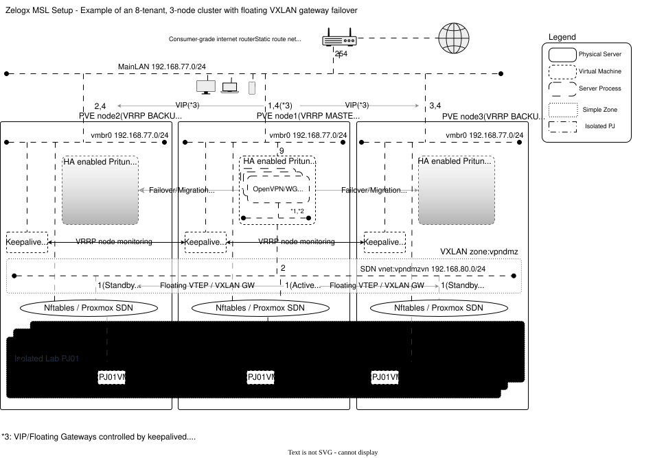
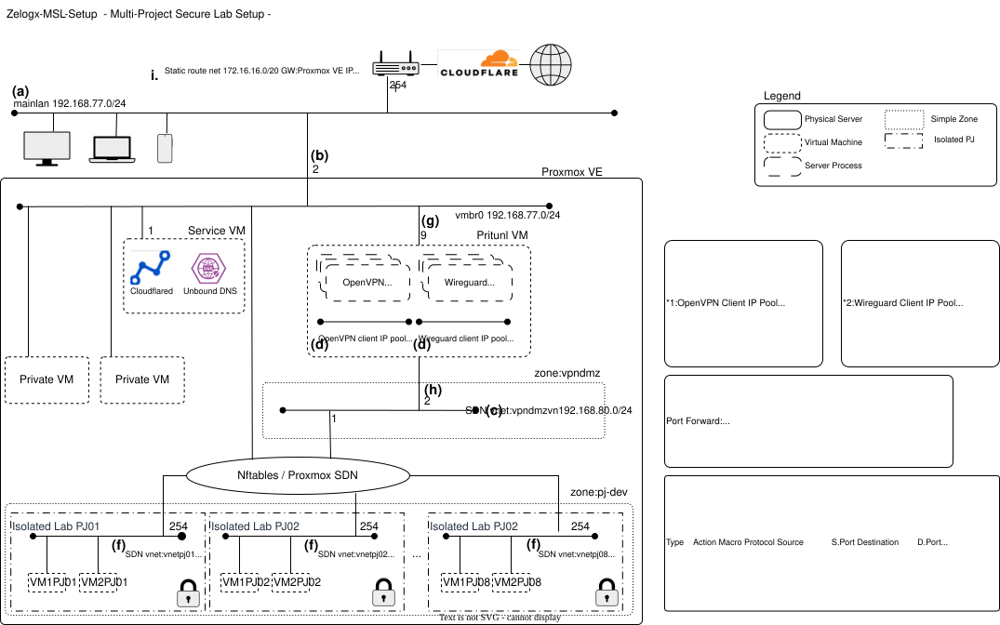

# Multiverse Secure Lab (MSL) Setup – The Multi-tenant Enabler for Proxmox by Zelogx™

[](https://github.com/zelogx/msl-setup/discussions)
[](https://github.com/zelogx/msl-setup/wiki/)
[](https://www.zelogx.com/ja/)
[](https://www.zelogx.com/ja/documents/release-notes/)

Zelogx™ MSL Setup (Multiverse Secure Lab Setup) は、The Multi-tenant Enablerとして、単一ノードから複数ノードのProxmoxクラスタまでを対象に、案件ごと・チームごとに隔離されたマルチテナント環境を構築するセットアップツールです。
Proxmox SDNとファイアウォールを自動設定し、素のハイパーバイザーを「マルチテナント対応の仮想空間の集合」へと変貌させます。
v2.0ではクラスタ対応が追加され、VXLANにより、複数ノードにまたがる隔離ネットワークも利用可能になりました。
さらに、テナント専用VPNを自動で組み合わせることで、必要な利用者がどこからでも安全に、プロジェクト単位のサブネットへアクセスできます。
GUIベースのVPN管理（Pritunl）とMFAにより、運用の手間を最小限に抑えつつ、仕組みで堅牢性を維持します。

このリポジトリは、その Personal Edition を提供します。

Refer to README.md for English documents.
> [English: README.md](./README.md) <BR>
> Official Web Site is [here](https://www.zelogx.com)

なお、以下のリポジトリは本セットアップスクリプトの手動構築手順です。
[MSL Setup Basic JP](https://github.com/zelogx/proxmox-msl-setup-basic/blob/main/build-instructions_jp.md)

## 概要

プロジェクトごとに完全に分離された L2 レベルの開発環境を構築し、VPN 経由で安全にアクセスできるようにします。
低コストの分散開発、オフショア案件、またはチーム向けプライベートラボのためのプラットフォームです。

MSL Setup のアーキテクチャの背景、設計思想、設計ポリシーについては、[ARCHITECTURE_AND_DESIGN_PRINCIPLES.md](./ARCHITECTURE_AND_DESIGN_PRINCIPLES_jp.md) を参照してください。

以下はアーキテクチャ図。


<section id="quickstart">

## 0. Quickstart

> [**既存環境への影響はほとんどの場合ありません**](https://github.com/zelogx/msl-setup/wiki/%E6%97%A2%E5%AD%98%E7%92%B0%E5%A2%83%E3%81%B8%E3%81%AE%E5%BD%B1%E9%9F%BF%E3%81%AB%E3%81%A4%E3%81%84%E3%81%A6)も参照してください。<BR>
> また対話式インストーラは重複ネットワーク検出機能があり、Proxmox内の既設ネットワークと重複するアドレスは指定できない仕組みです。<BR>
> [インストール方法解説記事](https://github.com/zelogx/msl-setup/wiki/%E8%87%AA%E5%AE%85%E3%81%AEPVE%E3%81%AB%E3%83%9E%E3%83%AB%E3%83%81%E3%83%86%E3%83%8A%E3%83%B3%E3%83%88%E5%8C%96%E3%83%84%E3%83%BC%E3%83%AB%E3%82%92%E5%85%A5%E3%82%8C%E3%81%A6%E3%81%BF%E3%81%BE%E3%81%97%E3%81%9F%E3%80%82%E3%82%A4%E3%83%B3%E3%82%B9%E3%83%88%E3%83%BC%E3%83%AB%E7%B7%A8)<BR>

rootでPVEへSSHログイン。

```bash
apt update -y
apt install -y git ipcalc jq zip

# Corporate editionの場合
# Downloadしたzipファイルをscpなどで置いてください。
unzip msl-setup-pro-1.x.x_corporate.zip    # change x to correct version number
cd msl-setup-pro-1.x.x_corporate

# Personal editionの場合
git clone https://github.com/zelogx/msl-setup.git
cd msl-setup

# Phase 0: TUI 自動ネットワーク設定 (既設ネットワーク確認とネットワークアドレス設定)
./00_configNetwork.sh jp  # 言語: en|jp (省略時 en)

# Phase 1: ネットワークセットアップ (設定確認 + SDN構築)
./01_networkSetup.sh jp   # 言語: en|jp (省略時 en)
./01_networkSetup.sh jp --restore   # SDN/ネットワーク設定をバックアップ状態へ復元
# Phase 1 完了後、ルーター設定を実施してください（ポートフォワード、静的ルート）
# Phase 1 終了時に表示される指示に従ってください

# Phase 2: VPN セットアップ (Pritunl VM 展開 + 設定)
./02_vpnSetup.sh jp   # 言語: en|jp (デフォルトen)

# Phase 3 (Pro Corporate エディション専用): RBAC Self-Care ポータルセットアップ
./0301_setupSelfCarePortal.sh jp   # 言語: en|jp (省略時 en)

# (任意) MSLセットアップを完全にアンインストール
./99_uninstall.sh jp   # 言語: en|jp (省略時 en)

# (任意）クラスタ運用コマンド
# v2.0以降の初期セットアップ時に既にProxmoxクラスタ状態だった場合は投入不要
# 新たにノードを追加した場合は`add-node`を実行してください
mslcm enable-cluster        # MSL Setupをクラスタ対応に昇格する
mslcm disable-cluster       # MSL Setupをシングルノードに降格する
mslcm add-node <IPアドレス> # MSL Setupのクラスタ設定にノードを追加する
mslcm del-node <IPアドレス> # MSL Setupのクラスタ設定からノードを削除する
```

> **注意:** インストール完了時点では、Pritunl VM は自動的に HA リソースとして登録されません。  
> クラスタ運用で Pritunl VM の HA 管理が必要な場合は、別途 Proxmox HA の設定を行ってください。

```
</section>


---

### セキュリティと設計上の選択（FAQ）

**Q: MSL Setup は、エンタープライズ向けネットワーク機器を使わずに、どのように VXLAN ゲートウェイのフェイルオーバーを実現しているのですか？**

**A:** MSL Setup v2.0 は、Proxmox クラスタ内部で自動 VXLAN ゲートウェイフェイルオーバーを行うことで、クラスタノードをまたいでも分離されたプロジェクトネットワークを継続利用できるようにしています。

言い換えると、これは軽量な floating VTEP / floating VXLAN gateway のような設計を、完全に Proxmox クラスタ内だけで実現しているものです。

- **外部ネットワークアプライアンス不要**: フェイルオーバー機構は Proxmox ノード内で実装されており、専用の外部ルータやエンタープライズ向けスイッチ基盤に依存しません。
- **現実的な環境に適した設計**: この方式は、小規模オフィスやホームラボを含む、一般的なスイッチ環境でも動作します。
- **なぜ EVPN ではないのか？** EVPN は強力ですが、一般的にはより大規模なネットワーク設計や高度な外部ネットワーク要件を前提とします。MSL Setup は、不必要にインフラ構成を複雑化せず、Proxmox ベースのラボ環境に適した、より軽量で実用的な設計を重視しています。
- **運用上の利点**: クラスタノードに障害が発生しても、自動 VXLAN ゲートウェイフェイルオーバーにより、分離されたプロジェクトネットワークへの到達性を維持できます。

これにより、よりシンプルな構成と低い運用負荷で、クラスタ全体にまたがる分離開発ネットワークを構築できます。
つまり、ゲートウェイのフェイルオーバー問題を外部ネットワーク機器に押し付けず、Proxmox クラスタ内部だけで解決する設計です。

---

**Q: VMホッピングは防げますか？**

**A:** はい。ラボ（テナント）境界で隔離が強制されます。

- **ラボ内**: 同一ラボ内のVM同士は相互通信を許可します。アプリ/クラスター/サービスの現実的な検証に必要な自由度を確保します。
- **ラボ間**: Nftables + Proxmox SDN（“マルチバース・エンフォーサー”）が案件ゾーン間の通信を遮断します。
- **ラボからホスト/管理系**: VPNクライアントプールと上流ゲートウェイ以外へのフォワードはデフォルトで遮断。ホスト管理ネットワークや他ラボは不可視のままです。

---

**Q: APIトークンと権限管理はどうしていますか？**

**A:** Zelogx MSL SetupはProxmox APIのトークン認証を使いません。ノード上でローカル実行し、root権限のProxmox CLI（`pvesh`など）を使用します。

- **なぜroot？** SDNオブジェクト、ブリッジ、nftablesの設定はProxmox上のシステムレベル操作であり、特権が必須です。
- **設計上の選択**: 追加のAPI面やトークンライフサイクルを持ち込まず、既存のProxmox権限モデルに依存します。変更内容は標準のProxmox SDN/Firewall設定として可視化され、監査やハードニング対象が増えません。


## 2. 開始方法

### 2.1. 必要要件

- Proxmox VE 9.0+ host(s)
- Internet router (for port forwarding VPN traffic)

### 2.2. アップグレード

v1.xからのアップグレードには対応してません。
v2.xをインストールする場合はv1.xを./99_uninstall.shでアンインストール後にv2.xをインストールしてください。

### 2.3. ネットワークアドレス

MSL Setup はネットワークアドレスを自動提案するため、以下の設定を事前にすべて設計しておく必要はありません。
一方で、利用環境内のすべての既設ネットワークを自動検出できるわけではないため、提案されたアドレスが既設ネットワークと重複しないことはご確認ください。
必要な場合は、`00_configNetwork.sh` のカスタムセットアップで調整できます。

カスタムセットアップでは以下のネットワークアドレスの入力が必要となります。\
Proxmox VEが接続しているサブネットワーク以外にセグメントがないという場合には、a,b以外は重複がない限り以下の例のままでもよいかと思います。a,bは現在利用中のネットワークを指定すれば問題ありません。



#### (a) **MainLan(vmbr0既設):** (例：`192.168.77.0/24` GW: `.254`)
   - 会社・自宅ラボのメインのLANのネットワークアドレス。
   - スマートスピーカーやTV, ゲーム機, 従業員, 家族のPC, スマホ, LAB用のVM(webサーバ, Cloudflare, nextcloud,samba, 個人用OpenVPN/Wireguard, Unbound DNSなど)などが接続されていると思いますが、各PJに分離されたVMからは、PVE Firewall, vnetにより完全に分離されるので、安全。
   - 後続の「Pritunlのmainlan側のIP」がこのIPレンジ内でなくてはならない。
   - インターネットルータの多くはLAN側IPにしかポート転送できないので、インターネットルータの直下のLANに接続してあることが望ましい。

#### (b) **Proxmox PVEのmainlanのIP:** (例：`192.168.77.2`)
   - インターネットルータへのstatic route追加時、宛先IPとなる。(自動取得、表示用)

#### (c) **vpndmzvn(新設):** (例：`192.168.80.0/24` GW: `192.168.80.1`)
   - VPNクライアントが各開発PJ用サブネットへアクセスするための経路
   - 最低/30のネットワークアドレスが必要。

#### (d) **クライアントへの配布IP:** (例：`192.168.81.0/24`)
   - wgとovpnで分けられる。例：`192.168.81.2-126/25`, `192.168.81.129-254/25`
   - これを更に「作成する開発用分離セグメントの作成数」で分割し/28とする。
   - 各PJ用にVPNできるクライアント数は最大13人となる。オフショア分散開発などはもっと多目に確保するとよい。

#### (e) **作成する開発用分離セグメントの作成数(PJ数):** (例：`8`)
   - 最低2で2のn乗2,4,8,16などになっている必要がある。
   - PJ数が8個の場合:PJ-IDは01-08で作成されます。セグメントもvnetpj01～vnetpj08で作成されます。

#### (f) **各PJ(vnetpjxx)に割り当てるネットワークアドレス(新設):** (例：`172.16.16.0/20`)
   - Project用セグメント。このIPレンジを「作成する開発用分離セグメントの作成数」で分割する。
   - 例：vnetpjxxに割り当てるネットワークアドレスが`172.16.16.0/20`、作成する開発用分離セグメントの作成数:8の場合、以下のように分割される
   - vnetpjxx内のVM群(`172.16.16.0/24`)は、上記セグメント内で通信は自由。
   - このVMへのFW設定はSecurity Group(SG)で制御される。
   - Pritunlのorgに対応

#### (g) **Pritunlのmainlan側のIP:** (例：`192.168.77.9`)
   - インターネットルータへのポートフォワード追加時の転送先IPとなる。

#### (h) **Pritunlのvpndmzvn側のIP:** (例：`192.168.80.2`)
   - Pritunlのクライアントが各PJ用サブネットに出ていくときのサブネットです。最低/30あれば間に合いますがここでは大きく/24で取ってます。

#### (i) **UDP ports** 
   - 作成する開発用分離セグメントの作成数(PJ数) x 2　(OpenVPN+Wireguard分):(`合計16ポート 11856-11863, 15952-15959`)

> **注意:** ルーターによっては、ポートフォワードできる数に制限がある。Buffaloルータでは最大32個でした。なので、(e)を決める際にはルータの最大ポートフォーワード数も念頭に置いて決定すること。
> また、IPoEでNDプロキシ/MAP-E/DS-Liteなどを使用している場合は使用できるポートに制限があるので、あらかじめ確認する必要がある。

## 4. 既知の問題 (Known Issues)

- **ネットワーク図のテーマ連動について**  
   SVGベースのネットワーク図の配色は、ProxmoxのGUIテーマ（Light/Dark）には**連動しません**。  
   代わりに、OS／ブラウザ側の `prefers-color-scheme` 設定に従って描画されます。  
   そのため、OSやブラウザがライトテーマの場合は、Proxmox GUIをダークテーマにしていても図はライトテーマ相当の配色で表示される場合があります（その逆も同様です）。

## 5. あとがき

適切に設計されたパブリッククラウドは強いし、
冗長電源、空調、マルチAZ、SLA、責任分界、フィジカルセキュリティ…など叶わない点はあります。
ある意味自由を奪ってセキュリティとコストの自由度を担保してみた結果、こうなったという一例です。

なお、この記事は家庭LABおじさんも出来るレベルで記載してますが、中小ソフトハウス、少人数SaaS開発、SIer、SES会社向けです。

## トラブルシューティング: UDP port forwarding validation failed

`02_vpnSetup.sh` の実行中に、以下のようなエラーで停止する場合があります。

'''bash
ERROR: UDP port forwarding validation failed
'''

これは、**VPN サーバ用に指定した UDP ポートへ外部から正しく到達できない** 場合に表示されます。  
多くの場合、MSL Setup 自体の不具合ではなく、**ルータ設定・回線仕様・ネットワーク経路** の問題です。

### 確認項目

1. **ルータのポートフォワード設定を確認する**
   - 正しいポート番号と転送先 IP は、`01_networkSetup.sh` 実行完了時のコンソールログに表示されます
   - 設定した UDP ポートが、Pritunl VM の mainlan 側 IP に向いていることを確認してください

2. **01_networkSetup.sh のログが残っていない場合**
   - 一度アンインストールしてから再実行すると、必要な設定値を再確認できます

```bash
./99_uninstall.sh jp
./01_networkSetup.sh jp
```

3. **ポート番号を変更して最初からやり直したい場合**
   - `00_configNetwork.sh` から再実行してください

```bash
./99_uninstall.sh jp
./00_configNetwork.sh jp
```

4. **ポートフォワード設定は正しいはずなのに失敗する場合**
   - ルータが別セグメント先 IP へのポートフォワードに対応していない可能性があります
   - Proxmox がルータ直下にいない場合、途中経路で転送できない構成もあります
   - IPoE / MAP-E / DS-Lite / ND Proxy などの環境では、使用できるポートに制限がある場合があります

5. **修正後の再実行**
   - 修正後に再度以下を実行してください

```bash
./02_vpnSetup.sh jp
```

### VPN サーバが不要な場合

Pritunl VM を削除するには、以下を実行してください。

```bash
./0201_createPritunlVM.sh jp --destroy
```

### ルータ設定は後で行うため、このチェックを一時的にスキップしたい場合

以下のファイルを配置してから、再度 `02_vpnSetup.sh` を実行してください。

```bash
touch /root/demo
./02_vpnSetup.sh jp
```

### 補足

このチェックで失敗した場合でも、**VM 自体はデプロイ済みで起動したまま** になっていることがあります。  
必要に応じて、以下のような確認が可能です。

```bash
ssh root@<Pritunl-VM-IP>
ping <GW IP Adress>
```